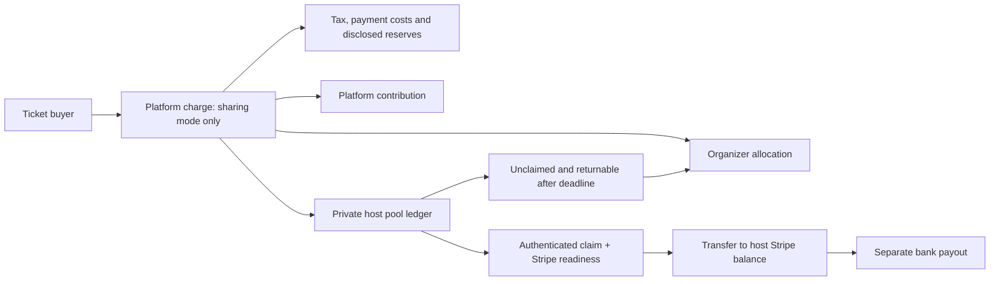

# Session host revenue sharing

Audit and proposed implementation, 28 September 2026. **Design only: host allocations, claims,
transfers and expired-claim returns are not implemented or enabled.** The current ticketing
integration remains direct charges to the organizer. This document separates observed behavior
from the proposed product and the business decision needed before changing payment routing.

## What exists today

| Area | Evidence | Finding |
| --- | --- | --- |
| Organizer contribution | `src/app/create/steps/ParticipationStep.tsx`, `src/app/create/useWizardState.ts`, `src/app/e/[slug]/admin/tickets/page.tsx` | Creation and Tickets expose a platform contribution of 1–50%. There is no host-share setting. |
| Checkout | `src/lib/payments/stripe.ts`, `src/lib/payments/references.ts`, migration 0029 | New Checkout Sessions belong to the organizer's connected account. The application fee is the platform contribution. Immutable references preserve the original money facts and charge model. |
| Organizer onboarding | `src/lib/payments/{connect,merchant,merchant-status,stripe}.ts` | Merchant accounts use the full Stripe Dashboard, with Stripe collecting processing fees and bearing connected-account negative balance liability. Accounts v2 is preferred; a tested v1 controller fallback exists. |
| Settlement and admission | `src/lib/payments/{deliveries,webhook}.ts`, `src/lib/tickets` | Signed, deduplicated webhooks settle recorded checkouts. Return pages do not grant admission. Refunds and account capability changes are handled. |
| Revenue dashboard | `src/app/api/v1/events/[slug]/admin/ticketing-settings/revenue/route.ts` | Reports sales and contributions. It is not a distributable-funds ledger and does not measure actual available Stripe balances. |
| Host payments | Search of runtime source and SQL migrations for host shares, claims, transfers and payouts | No host Connect-account association, host pool, allocation ledger, claim deadline, transfer worker, or payout recovery UI. Old strategy documents describe unshipped wallet/smart-contract ideas. |
| Production activation | Read-only environment-presence check on Hetzner, 28 September 2026 | Stripe key, live key, webhook secret and Connect webhook secret all absent. No secrets displayed; no live transaction attempted. Sandbox evidence is recorded in `STRIPE_ACTIVATION.md`. |

The organizers sell admission to their own events. Participants buy tickets; session hosts
contribute sessions. Those roles and the existing direct-charge relationship are high-confidence
facts from the product and code. The desired host share and expiry mechanism are explicit user
requirements. Whether unconference should become the business collecting these payments and
take on the corresponding financial responsibilities is **not yet decided**.

### Hardening required before any allocation uses ticket revenue

These are code-review findings, not claims of observed loss or live exploitation:

1. **Refund identity and accounting need repair.** `refundTicket()` uses
   `refund-<session>-<amount>` as its Stripe idempotency key, then adds the returned amount to
   `checkout_references.refunded_amount`. Two intended equal partial refunds reuse one Stripe
   operation, while the local total can advance twice. Concurrent requests or a webhook arriving
   before the route finishes can also make additive accounting overstate refunds. Give each
   authorized refund operation a durable identity, record Stripe refund IDs uniquely, serialize
   money changes, and reconcile cumulative provider facts. Test crashes and ambiguous timeouts.
   Audit `webhook.ts:returnPayment` alongside the organizer route; both write refund totals.
2. **The revenue summary cannot fund a pool.** It sums original ticket amounts for active tickets,
   so a partial refund does not reduce that figure. It excludes fully refunded references from
   fee totals even if the application fee was retained. Its single currency label is selected
   from the first tier although the query aggregates all tiers. Compute net cash from payment,
   refund, fee and dispute facts, grouped by currency; display gross sales separately.
3. **Disputes and host transfers have no lifecycle here.** The current webhook switch handles
   checkout, refunds and account updates, but has no host-transfer, bank-payout or dispute ledger.
   This is especially significant if charges move onto the platform account.

Do not enable revenue sharing by multiplying the existing dashboard's `netRevenue` by a percentage.

## Decision: how the host pool is funded

| Approach | Experience | Financial consequence | Recommendation |
| --- | --- | --- | --- |
| Separate charges and transfers for new, opted-in gatherings | Ticket receipts fund an organizer allocation and a reserved host pool; hosts claim later | Charges live on unconference. The platform balance pays processing costs, refunds and disputes; recipient account configuration and operational responsibilities change | Best fit for automatic ticket-funded sharing, **conditional on owner approval and Stripe readiness** |
| Keep direct charges; organizer funds distributions separately | Organizer receives ticket proceeds as today, then funds an explicitly approved host budget | Preserves the ticket merchant relationship, but requires a separately designed and verified funding operation | Alternative if the platform should not collect ticket proceeds; cannot promise an automatically reserved pool |

Stripe supports splitting platform charges into multiple transfers. Refunding the original charge
does not itself reverse those transfers. This is a materially different integration from the
existing one. [Stripe separate charges and transfers](https://docs.stripe.com/connect/separate-charges-and-transfers)

Do not silently enlarge the current application fee to disguise a host pool, debit an existing
organizer account, or reroute already-created checkouts. An organizer-as-settlement-merchant
variation using `on_behalf_of` needs its own Stripe/account-compatibility review; it does not remove
platform-balance exposure. Existing direct-charge references must retain their original behavior.

## Proposed organizer experience

Use one **Ticket revenue** card in the creation wizard's Participation step and in Organizer →
Tickets. The Revenue page owns settlement and distributions; it should not duplicate editable
policy controls.

- **Platform contribution:** existing 1–50%, with the actual percentage and fee basis stated.
- **Share revenue with session hosts:** off by default; opting in reveals **Share of net proceeds**,
  allocation method and claim window. Suggested starting values: 20%, equal per completed session,
  30 days to claim. These are proposed defaults, not provider requirements or enabled settings.
- **Live calculation:** show ticket receipts, refunds, tax, Stripe costs, platform contribution,
  net proceeds, host pool, and organizer remainder. Before settlement, label the numbers estimates.
- **Unclaimed allocations:** explain the deadline and proposed organizer-return rule before saving.
  Hosts see the same policy before accepting a paid-host role. No surprise retroactive expiry.
- **Readiness:** explain the specific missing setup step. Free gatherings need no Connect setup.
  An unready host may propose or host; the payment page explains how to become eligible to receive funds.

Freeze the financial policy when the first paid checkout opens, not after its webhook arrives.
Version any subsequent policy; changing already-promised host rights requires an explicit,
audited amendment with affected hosts' acceptance. Changes to organizer ownership must not
silently change the payout recipient for existing proceeds.

### Proposed pool arithmetic

Use integer minor units, a currency exponent table, and basis-point percentages. Initial rollout
should support one explicitly verified currency and region, not assume all currencies use cents.

```text
receipts less refunds and indirect tax                    = eligible sales
eligible sales less actual processing costs,
  documented payment adjustments and platform contribution = net proceeds
max(0, net proceeds) × host share                         = host pool
net proceeds less host pool                              = organizer allocation
```

For illustration only: $1,000 eligible sales − $35 actual payment costs − $10 platform contribution
= $955 net proceeds. A 20% host share produces $191 for hosts and $764 for the organizer.
With ten eligible sessions, that is $19.10 per session before any explicitly disclosed recipient
payout cost. These costs are illustrative, not Stripe price quotes. A 1% platform contribution
does not cover all marketplace costs by itself; Connect account/payout charges and unrecovered
disputes need an explicit cost policy. [Stripe pricing](https://stripe.com/pricing)

Keep refund/dispute reserves separate from earnings: a temporary reserve delays availability;
it is not a permanent deduction. Show any retained application fee and nonrefundable processing
fee explicitly. If costs exceed proceeds, show the deficit to the organizer/operator and block
distribution instead of making a negative allocation or silently spending another event's pool.

### Allocation proposal

Start with equal shares per **verified completed session**, then equal shares among the primary
host and accepted co-hosts on that session. Organizers confirm completion; hosts can review and
dispute the roster before allocations are locked. Invitations that were never accepted confer
no entitlement. Withdrawn, cancelled, duplicate/merged and host-less sessions are excluded with
a recorded reason. A host of multiple completed sessions may receive multiple shares.

Use deterministic largest-remainder rounding so allocations sum exactly to the pool. Publish
the rule before sales. Support an explicit override only before locking, with reason and host
acceptance; never let an organizer substitute a payout recipient after a claim.

Do not base payments on open voting totals. A later vote-weighted option needs a separate policy
decision, abuse controls, and a privacy analysis: small-group suppressed tallies cannot be exposed
indirectly through exact payment amounts. Existing ballots must remain private and unlinkable.

## Proposed host experience and claim lifecycle

Add **Earnings** to the account menu/More sheet when the person has an allocation or hosts in a
sharing-enabled gathering. Show a small earnings card in My sessions and the host's session view;
financial details are private, never in public ATProto records or profiles.

Each gathering shows the amount, calculation, eligibility, deadline in local time and UTC,
payment setup status, and one relevant action: **Review share**, **Claim earnings**, **Complete
Stripe setup**, **Fix payment details**, or **View payout**. A signed-in host can see this even if
they lack a ticket. They cannot see other hosts' bank or verification details.

```text
estimated → under review → allocated → claimable → claimed → transfer queued → transferred
                                           └→ expired → organizer return queued → returned

claim / transfer holds: needs setup, provider review, dispute, compliance or service outage
bank payout: pending → paid / failed (tracked separately from the host's claim)
```

The claim is authenticated acceptance of an entitlement, not merely opening a link. Confirm
server-side account ownership and claimable allocation under a row lock. Require recent
authentication to bind or change a Stripe recipient account; a 90-day app session alone is not
enough to redirect money. Email/push links navigate to the authenticated claim page and carry no
bearer authority to withdraw funds. OAuth-only users may not have email: the in-app inbox is a
first-class notification surface.

Proposed default: 30 days from the later of allocation availability and successful creation of
the in-app notice, with reminders 7 days and 1 day before expiry. Allow 14/30/60-day choices only
within provider and jurisdiction limits. Hosts who claim on time but are still in Stripe review
do **not** become unclaimed. Give incomplete setup a separately disclosed grace period and
operator review; system outages pause expiry. Bank failure after transfer is never a reason to
reclaim an allocation as unclaimed.

**Reclaim means returning an untransferred allocation.** At the deadline, serialize expiry
against claims and transfer jobs. Only never-claimed, untransferred, legally returnable amounts
can move into the organizer-return ledger. Show the exact amount and reason before an authorized
organizer requests return. Retrying creates no second transfer. If the organizer cannot receive
it, show a blocked return rather than mark it paid.

A Stripe transfer moves funds to a connected account; a payout moves that balance to a bank.
Stripe does not offer escrow, and holding limits depend on country. The ticket sale date, event
date, review period, claim window and grace period must all fit the applicable limit; a 30-day
claim window alone does not make a year-long advance sale safe.
[Stripe manual payouts](https://docs.stripe.com/connect/manual-payouts)

The expiry policy is an application proposal, not a determination that earned compensation can
legally be forfeited. Verify the applicable contract, tax and unclaimed-property treatment and
Stripe's permitted holding arrangement before enabling automatic organizer returns.

## Connect configuration for the automatic-sharing option

For new recipient accounts, use Accounts v2 (`/v2/core/accounts`), Express Dashboard access,
platform-managed pricing, and platform responsibility for negative balances. Request recipient
Stripe transfers; hosts who only receive funds do not need card-payment acceptance. Existing
full-Dashboard merchant accounts are not silently converted: responsibility fields can be
immutable. Verify a compatible recipient setup before enabling this mode for an organizer.
[Stripe account configuration](https://docs.stripe.com/connect/accounts-v2/connected-account-configuration)

Use Stripe-hosted onboarding initially: the app already has that interaction pattern, and Stripe
collects legal identity, country, bank and verification documents. Save only provider identifiers
and capability/status summaries. Reopening setup creates an account link server-side for the
authenticated owner; the return URL is not proof of readiness.

Gate transfers on current recipient transfer capability and gate bank availability on current
payout capability. For v2, inspect `configuration.recipient.capabilities.stripe_balance`:
`stripe_transfers.status` and `payouts.status` must be active for their respective operation.
Support changing requirements throughout the lifecycle, not just initial onboarding.

Provide Express Dashboard login links and in-app account management, a notification banner and
payout views. Embedded onboarding can replace the hosted redirect later. The notification banner
surfaces new verification requirements. [Stripe notification banner](https://docs.stripe.com/connect/supported-embedded-components/notification-banner)

For separate charges, Express does not let recipients operate the original customer's refunds
or disputes; unconference needs its own organizer/operator support flow.
[Stripe Express payment visibility](https://docs.stripe.com/connect/express-dashboard/payments)

Fee mode for this option: `applicationFeeIncludes` is **not applicable**. There is no
`application_fee_amount`; retain the chosen platform share through transfer arithmetic.
Existing direct charges retain `platform_fee_only` behavior. This proposal uses transaction
contributions, not recurring SaaS subscriptions, and needs no `customer_account` subscription flow.



### Negative balance liability

Platform charges expose the platform balance to refunds and disputes. Platform responsibility for
recipient negative balances also needs to be explicit. A transfer reversal may aid recovery but
is not guaranteed; do not fund the design on assumed clawbacks from a bank. Preserve an adequate
reserve and a recovery process. [Stripe risk and liability](https://docs.stripe.com/connect/risk-management)

### Risk management

Use Stripe Radar, organizer verification, first-event distribution review, velocity limits,
release thresholds and an operator pause. Treat those controls separately from who ultimately
bears a deficit. Recheck provider readiness and available backing funds immediately before
dispatch; an application ledger is not bank segregation.
[Stripe account balances](https://docs.stripe.com/connect/account-balances)

### Webhook integration

Verify and durably deduplicate provider deliveries, reconcile authoritative payment/account/transfer/payout facts, and never mark funds received from a return URL.

## Private data model and worker contract

Proposed tables, all private by default with explicit RLS and event-scoped authorization:

| Table | Purpose and invariants |
| --- | --- |
| `event_revenue_policies` | Versioned percentages, basis, eligibility, currency, deadline/grace and return terms; immutable once referenced by checkout. |
| `payout_accounts` | Private app-account → provider recipient association, mode, country, capabilities; unique verified owner, no browser-supplied account-ID substitution. |
| `revenue_ledger_entries` | Append-only balanced entries per currency for settled receipts, refunds, fees, reserves, allocations and returns; unique external operation identity; corrections by reversal entries. |
| `host_allocations` | Event, session, recipient, policy/roster snapshot, amount and currency, state, claim/deadline timestamps; frozen before claims open. |
| `distribution_operations` | Durable transfer/reversal/return intent, immutable amount and recipient, idempotency key, provider ID, attempts and reconciled result. |
| `payout_observations` | Connected-account bank-payout facts; do not assert a one-to-one allocation/payout relationship when Stripe batches funds. |

Extend immutable checkout references with the policy version and charge model for new sales;
do not rewrite old references. Financial account deletion/retention must preserve unresolved
obligations without retaining unrelated buyer identity indefinitely. Event/session deletion must
not cascade away settled financial facts. Keep co-host identity consent and public-record rules.

Use a transaction to lock the allocation, verify permissions/state and append an operation plus
outbox notice. Commit before calling Stripe. A worker leases that operation and uses its stable
idempotency key; a timeout becomes **unknown/reconciling**, not a new operation. Do not recycle a
key for a different recipient or amount. After the provider's idempotency retention period,
reconcile against stored provider IDs and metadata before any retry.

Reconcile Stripe transfers and available funds independently of bank payouts. Failed transfers
need an explicit retry policy; transferring money requires sufficient funds or appropriate source
charge linkage. A transfer group is a correlation label, not a reserve.
[Stripe transfer API](https://docs.stripe.com/api/transfers/create)

Refunds/disputes before release reduce backed allocations or place them on hold. After release,
record the deficit and attempt only authorized recovery; never mark an unsuccessful reversal as
recovered. Partial reversals cannot exceed the original unreversed transfer.
[Stripe transfer reversals](https://docs.stripe.com/api/transfer_reversals/create)

## Delivery plan and acceptance gate

1. Approve the funding/merchant responsibility model. Confirm the legal operating entity,
   supported recipient region/currency, Stripe eligibility and return terms. Keep live sharing off.
2. Repair refund operation identity and revenue accounting; add repeated-equal-refund,
   webhook-race, partial-refund, retained-fee and mixed-currency regression coverage.
3. Implement policy and ledger migrations, private authorization, host/organizer previews and
   versioned checkout references. No fake enabled payment controls.
4. Add recipient onboarding, claims, expiry, outbox workers, reconciliation, provider-state
   remediation and the organizer distribution workspace.
5. Prove the complete flow in a dedicated Stripe sandbox using actual onboarding and webhooks:
   sale → refund adjustments → allocation → claim → transfer → payout status; unclaimed expiry
   → organizer return; replay and concurrent claim/expiry → exactly one outcome.
6. Exercise co-host changes, cancelled/merged sessions, no eligible sessions, zero/tiny pools,
   rounding, disabled capabilities, deleted accounts, late refunds, disputes, insufficient funds,
   failed bank payouts, worker crashes after Stripe success, clock boundaries and missed notices.
7. Configure persistent live keys/webhooks only after readiness is verified. A separately
   authorized small real payment and refund must validate production before advertising paid
   sharing. Roll out to one opt-in gathering with amount limits and reconciliation alerts.

Owner decision needed: **automatic ticket-funded sharing with the platform's new financial
responsibilities, or unchanged direct ticket charges with a separately funded host budget?**
The proposed allocation and claim UX can serve either, but the underlying charge/funding model
must be settled before implementation.
